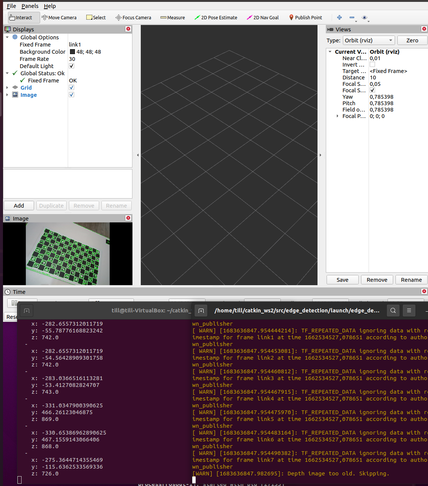

# Vision Programming Challenge Solution

## Overview
Task *1 Basic* as well as *Task 2 Vision_ROS* was attempted and completed. The programming language used is python.  
The package structure is build upon the given edge_detection directory. Its final structure is as follows:
```
-- edge_detection/
    |
    -- data/
        |
        -- IMAGE_1.png
        -- ..
    -- docs/
        |
        --screenshot_bag_file_launch.png
        --screenshot_local_file_launch.png
    -- launch/
        |
        -- edge_detection_with_bag_file.launch
        -- edge_detection_with_local_file.launch
    -- rviz/
        |
        -- urdf.rviz
    -- scripts/
        |
        -- detector_client.py
        -- edge_detector.py
        -- stream_consumer.py
    -- srv/
        |
        --EdgeDetection.srv
    -- CMakeLists.txt
    -- package.xml
-- README.md
```
The package 'edge_detection' can be pulled from github in a catkin workspace src folder e.g. */catkin_ws/src*.  
After pulling,
- the *devel/setup.bash* file must be sourced,
- catkin_make command must be runned and
- roscore service must be started.

Afterwards the launch files in *edge_detection/launch* directory can be runned.

### Launch
The launch directory contains two launch files: 
1. 'edge_detection_with_local_file.launch' file corresponds to the task in *1. Basic*
2. 'edge_detection_with_bag_file.launch_ corresponds to task *2. Vision_ROS*

They can be started via the command:

```bash
roslaunch edge_detection <launch-file.launch> <args:=filepath>
```
In both cases arguments must be provided to either locate an image or the bagfile.

#### edge_detection_with_local_file.launch
Starts two nodes based on python scripts, namely:
1. edge_detector.py
2. detector_client.py

When launching the file a a *file:=* argument can be passed, specifying the path of the image to detect the edges in. The default path is specified as *$(find edge_detector)/data/Image_1.png*  
The analyzed image gets displayed via an image display window.

#### edge_detection_with_bag_file.launch
Starts 4 nodes in default mode, namely:
1. rosbag.play
2. edge_detection.py
3. stream_consumer.py
4. rviz

When launching the file a a *bagfile:=* argument should be passed, specifying the path of the bagfile which will be played in loop. Default path is: *$(find edge_detection)/data/withoutpointcloud.bag*
The rviz player node can be turned of when setting the argument *'open_rviz'* to *false*. The rviz player takes the configuration *urdf.rviz* file located in *edge_detection/rviz/* as input.

### Scripts
#### detector_client.py
This python script is a simple client which takes a filepath, trys to read the image and if succeeded, sends the image to the 'edge_detetion' node created in *edge_detector.py*. For transmitting an image, it is converted using the CvBridge of the cv_bridge python package.

If executed with *rosrun*, the path where the image file is located must be provided as argument. If executed within the given launch-file the launch command will parse the given *file:=* argument or the default argument.

#### edge_detector.py
This python script creates an edge detection service which serves according to the *srv/EdgeDetection.srv* service file (one sensor_msgs/Image in, one sensor_msgs/Image out). CvBridge helps converting between ROS MAT and numpy format of image data. 

Edges are detected using the **Canny Algorithm**.  
[TODO] The given parameters are generic and may require some adjustment. Nevertheless, the parameters seem to give reasonable results for a starting point.  
Edges are colored green in the returned image.

Corners are detected using **Corner Harris Algorithm**. The method *detect_corners(img)* is implemented, but not used in the final submission.

#### stream_consumer.py
This pythons script serves as a node to subscribe to all relevant topics from the given .bag file, evaluate them by detecting edges in the camera stream and convert 2d points in 3d points, and publish these findings into new topics.

Subscribers to the following topics are set up:
- /camera/color/image_raw
- /camera/depth/image_rect_raw
- /camera/color/camera_info
- /camera/depth/camera_info
- /edge_detection/edged_image

Publishers to the following topics are set up:
- /edge_detection/edged_image
- /edge_detection/edge_points

The new publishing topics publish *sensor_msgs/Image* and *sensor_msgs.msg/PointCloud* messages, respectively.

An **eged_image** (Image) represents a camera image from the */camera/color/image_raw* topic, which was analyzed using the *edge_detector.py* node from task 1. *broker(imgmsg)* takes care of calling the edge_detector service and publishing the analyzed image afterwards.  
The **edge_points** (PointCloud) are calculated using homogenous coordinate transformation in function *construct_3d_points(..)*. The numpy array of the 3d points is then converted into *geometry_msgs/Point32* objectes which then get wrapped up in a list, representing the PointCloud points.  
[TODO] The results of the 3d points should be checked for validity as the function is implemented form scratch. Also the possible translation of the depth camera to the color camera is ignored, because the frame_id linked to the depth camera (*camera_depth_optical_frame*) could not be found in any publishing topic. This may lead to additional errors.

### ROS Packages
Build Tool: catkin  
The following ROS packages where used:
- rospy
- cv_bridge
- std_msgs
- geomertry_msgs
- sensor_msgs

They are declared in both, *package.xml* and *CMakeLists.txt*

Further Python packages were included:
- rospy, cv2, numpy, queue

The packages did not need any explizit installation, but came with the installation of ROS Noetic or Ubuntu OS.

## Final View
When starting the launch file *edge_detection_with_bag_file.launch* the following should be observable:
 - Rviz window displaying images with detected edges
 - Stdout Output in starting Console
 - Data publishing to topic */edge_detetion/edge_points* which can be subsrcibed to from another console by using cmd ```rostopic echo /edge_detection/edge_points```

